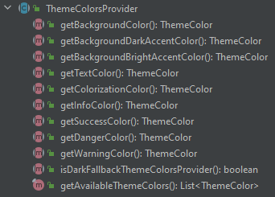
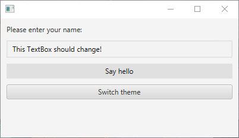
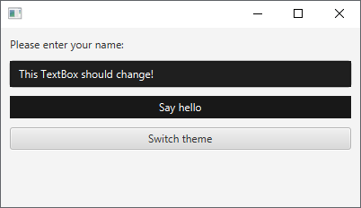

# Theme manager 🎨

The "ThemeManager"-class can be used to assign custom CSS to an arbitrary amount of "Parent" instances 
(class "javafx.scene.Parent").

The ThemeManager also includes an optional "theme"-mechanism, to provide colors, which can be used to customize the 
look of the rendered GUI-components.

See the following sections for more information.

## 1. Setup of available theme-colors (class "ThemeColorsProvider")

To create a ThemeManager-instance, you must specify which theme-colors are available. To do this, an instance of the 
type "ThemeColorsProvider" must be passed to the ThemeManager-constructor.

A ThemeColorsProvider-implementation must always implement the following functions. Each function provides an individual 
"ThemeColor"-instance. The functions represent the base-colors which must always be available:



If no custom colors are required, an instance of the class "DefaultThemeColorsProvider" can be passed to the
constructor. The DefaultThemeColorsProvider-class contains an implementation for every required 
ThemeColorsProvider-function. Each function returns a "ThemeColor" instance, which consists of a color-name and a 
default-color (class "javafx.scene.paint.Color").

The base-colors implemented in the DefaultThemeColorsProvider-functions are bright colors, which is the reason why the 
function "containsDarkDefaultThemeColors" returns "false". This information can be accessed from the created 
ThemeManager-instance, to check if a dark or a bright theme is active.

Implementation of the DefaultThemeColorsProvider-class (shortened):

```java
public class DefaultThemeColorsProvider extends ThemeColorsProvider {
    @Override
    public ThemeColor getBackgroundColor() {
        //The first base-ThemeColor to implement, with the name "backgroundColor" and the default-color "#f3f3f3".
        return new ThemeColor("backgroundColor", Color.web("#f3f3f3"));
    }

    //Other functions providing default-ThemeColor-instances...

    @Override
    public ThemeColor getWarningColor() {
        //The last base-ThemeColor to implement, with the name "warningColor" and the default-color "#ffc107".
        return new ThemeColor("warningColor", Color.web("#ffc107"));
    }

    @Override
    public boolean containsDarkDefaultThemeColors() {
        //All colors in this ThemeColorsProvider-class are bright colors. Therefore, this class doesn't contain dark 
        //theme-colors.
        return false;
    }
}
```

### Create a ThemeManager-instance with default-colors

If no custom colors are required, you can pass an instance of the class "DefaultThemeColorsProvider" to the constructor:

```java
package io.github.zeront4e.apps.hjw;

import io.github.zeront4e.ejg.theme.ThemeManager;
import io.github.zeront4e.ejg.theme.colors.DefaultThemeColorsProvider;
import javafx.application.Application;
import javafx.scene.paint.Color;
import javafx.stage.Stage;

public class Main extends Application {
    public static void main(String[] args) {
        launch(); //Launch the actual JavaFX application.
    }

    @Override
    public void start(Stage primaryStage) {
        //Create a ThemeManager with default theme-colors.
        ThemeManager<DefaultThemeColorsProvider> themeManager = new ThemeManager<>(new DefaultThemeColorsProvider());

        //Get the default "warning"-color.

        Color warningColor = themeManager.getColor(DefaultThemeColorsProvider::getWarningColor);

        String hexWarningColor = themeManager.getHexColor(DefaultThemeColorsProvider::getWarningColor);
    }
}
```

### Create a ThemeManager-instance with custom colors

Custom colors can be provided, by implementing your own ThemeColorsProvider-class. This can be achieved, by extending 
the ThemeColorsProvider-class. However, in the following example only a single additional color should be added to the 
existing default-base-colors. Therefore, the DefaultThemeColorsProvider-class gets extended.

ThemeManager with custom colors (class "CustomThemeColorsProvider"):

```java
package io.github.zeront4e.apps.hjw;

import io.github.zeront4e.ejg.theme.ThemeManager;
import io.github.zeront4e.ejg.theme.colors.DefaultThemeColorsProvider;
import io.github.zeront4e.ejg.theme.colors.ThemeColor;
import javafx.application.Application;
import javafx.scene.paint.Color;
import javafx.stage.Stage;

public class Main extends Application {
    //We create a custom ThemeColorsProvider, to support additional colors.
    //We keep all default colors, by extending from the DefaultThemeColorsProvider-class.
    public static class CustomThemeColorsProvider extends DefaultThemeColorsProvider {
        public ThemeColor getHighlightColor() {
            //The color with the name "highlightColor" has the default-color "#f6ff33".
            return new ThemeColor("highlightColor", Color.web("#f6ff33"));
        }
    }

    public static void main(String[] args) {
        launch(); //Launch the actual JavaFX application.
    }

    @Override
    public void start(Stage primaryStage) {
        //Create a ThemeManager with custom colors.
        ThemeManager<CustomThemeColorsProvider> themeManager = new ThemeManager<>(new CustomThemeColorsProvider());

        //Get the custom "highlight" color.

        Color highlightColor = themeManager.getColor(CustomThemeColorsProvider::getHighlightColor);

        String hexHighlightColor = themeManager.getHexColor(CustomThemeColorsProvider::getHighlightColor);
    }
}
```

## 2. Access and usage of the ThemeManager

All available colors can be accessed programmatically and within the set CSS. The following example shows 
both ways. 

In the following example the ThemeManager is accessible to all GuiController-classes, by using the 
dependency-injection-mechanism of this library (see "dependency-injection" for more information).

Content of the file "Main.java":

```java
package io.github.zeront4e.apps.hjw;

import io.github.zeront4e.apps.hjw.controllers.HelloWorldGuiController;
import io.github.zeront4e.ejg.controllers.*;
import io.github.zeront4e.ejg.theme.ThemeManager;
import io.github.zeront4e.ejg.theme.colors.DefaultThemeColorsProvider;
import javafx.application.Application;
import javafx.scene.Scene;
import javafx.stage.Stage;

public class Main extends Application {
    public static void main(String[] args) {
        launch(); //Launch the actual JavaFX application.
    }

    @Override
    public void start(Stage primaryStage) throws DependencyInjectionException, ControllerInitializationException {
        //We create a GuiConfiguration-instance with default-settings.
        GuiConfiguration guiConfiguration = new GuiConfiguration(primaryStage);

        //It is recommended to set the package-scan-path to avoid unnecessary reflection-lookups.
        //Note that ALL GuiController-related classes must be found in the specified package or a sub-package (this 
        //includes GuiController-implementations and dependency-injection related functions).
        guiConfiguration.setPackageScanPath("io.github.zeront4e.apps.hjw");

        GuiControllerManager guiControllerManager = new GuiControllerManager(guiConfiguration);

        //Show the scene of the HelloWorldGuiController-instance.
        Scene helloWorldScene = guiControllerManager.getCachedSceneOrNull(HelloWorldGuiController.class);

        primaryStage.setScene(helloWorldScene);
        primaryStage.show();
    }

    @InstanceProvider
    public static ThemeManager<DefaultThemeColorsProvider> createThemeManager() {
        //Set initial custom CSS. The variables "{{backgroundColor}}" and "{{backgroundDarkAccentColor}}" will be
        //replaced with the colors from the set ThemeColorsProvider. In this case "{{backgroundColor}}" and 
        //"{{backgroundDarkAccentColor}}" will be replaced with the color-values, provided by the 
        //DefaultThemeColorsProvider.

        String applicationCss = """
                .text-field {
                    -fx-background-color: {{backgroundColor}};
                    -fx-border-color: {{backgroundDarkAccentColor}};
                    -fx-border-width: 1.5;
                }
                """;

        //Create a ThemeManager with default-colors and a custom CSS-string.
        return new ThemeManager<>(applicationCss, new DefaultThemeColorsProvider());
    }
}
```

Content of the file "HelloWorldGuiController.java":

```java
package io.github.zeront4e.apps.hjw.controllers;

import io.github.zeront4e.ejg.controllers.GuiController;
import io.github.zeront4e.ejg.controllers.InstanceConsumer;
import io.github.zeront4e.ejg.theme.ThemeManager;
import io.github.zeront4e.ejg.theme.colors.DefaultThemeColorsProvider;
import javafx.fxml.FXML;
import javafx.scene.control.Button;
import javafx.scene.control.TextField;
import javafx.scene.layout.Background;
import javafx.scene.paint.Color;

public class HelloWorldGuiController extends GuiController {
    @InstanceConsumer
    private ThemeManager<DefaultThemeColorsProvider> themeManager;

    @FXML
    private TextField txtUserName;

    @FXML
    private Button btnSayHello;

    @Override
    public void onInitialized() {
        //The ThemeManager-instance is accessible when this function is called.

        //Add the ThemeManager-CSS to all GUI-components of this GuiController.
        themeManager.addParent(getRootNode());

        //Set the colors of the Button manually (this could also be achieved by using CSS-classes).

        Color infoColor = themeManager.getColor(DefaultThemeColorsProvider::getInfoColor);
        Color brightAccentColor = themeManager.getColor(DefaultThemeColorsProvider::getBackgroundBrightAccentColor);

        btnSayHello.setBackground(Background.fill(infoColor));
        btnSayHello.setTextFill(brightAccentColor);
    }

    @Override
    public boolean isCacheableGuiController() {
        return true;
    }

    @Override
    public String getFxmlPath() {
        return "/fxml/hello-world.fxml";
    }
}
```

Result:


## 3. Overwrite default theme-colors (class "ThemeColorSource")

ThemeColor-instances always contain a default color-value. The available theme-colors are defined in a theme-specific 
ThemeColorsProvider-class. It is possible to load different ThemeColorsProvider-implementations, which allows the user 
to swap the available colors, accessible from the ThemeManager-instance.

Beside changing the ThemeColorsProvider-implementation it is possible to dynamically overwrite the colors of the set 
ThemeColorsProvider, by setting a "ThemeColorSource"-instance. 

All ThemeColorSource-instances must be created by using the static functions inside the ThemeColorSource-class. 

It is possible to create ThemeColorSource-instances from various sources, which map individual color-names to individual 
color-values:


The following example shows how to overwrite the default-colors of the DefaultThemeColorsProvider-class. The goal is to
switch between a bright and a dark version of the DefaultThemeColorsProvider-theme. Look at the implementation of the
"DefaultDarkThemeColorSourceProvider"-class for more information. 

Content of the file "Main.java":

```java
package io.github.zeront4e.apps.hjw;

import io.github.zeront4e.apps.hjw.controllers.HelloWorldGuiController;
import io.github.zeront4e.ejg.controllers.*;
import io.github.zeront4e.ejg.theme.ThemeManager;
import io.github.zeront4e.ejg.theme.colors.DefaultThemeColorsProvider;
import javafx.application.Application;
import javafx.scene.Scene;
import javafx.stage.Stage;

public class Main extends Application {
    public static void main(String[] args) {
        launch(); //Launch the actual JavaFX application.
    }

    @Override
    public void start(Stage primaryStage) throws DependencyInjectionException, ControllerInitializationException {
        //We create a GuiConfiguration-instance with default-settings.
        GuiConfiguration guiConfiguration = new GuiConfiguration(primaryStage);

        //It is recommended to set the package-scan-path to avoid unnecessary reflection-lookups.
        //Note that ALL GuiController-related classes must be found in the specified package or a sub-package (this 
        //includes GuiController-implementations and dependency-injection related functions).
        guiConfiguration.setPackageScanPath("io.github.zeront4e.apps.hjw");

        GuiControllerManager guiControllerManager = new GuiControllerManager(guiConfiguration);

        //Show the scene of the HelloWorldGuiController-instance.
        Scene helloWorldScene = guiControllerManager.getCachedSceneOrNull(HelloWorldGuiController.class);

        primaryStage.setScene(helloWorldScene);
        primaryStage.show();
    }

    @InstanceProvider
    public static ThemeManager<DefaultThemeColorsProvider> createThemeManager() {
        //Set initial custom CSS. The variables "{{backgroundColor}}" and "{{backgroundDarkAccentColor}}" will be
        //replaced with the colors from the set ThemeColorsProvider OR the set colors of the ThemeColorSource.

        String applicationCss = """
                .text-field {
                    -fx-background-color: {{backgroundColor}};
                    -fx-border-color: {{backgroundDarkAccentColor}};
                    -fx-border-width: 1.5;
                    -fx-text-fill: {{textColor}};
                }
                """;

        //Create a ThemeManager with default colors and a custom CSS-string.
        return new ThemeManager<>(applicationCss, new DefaultThemeColorsProvider());
    }
}
```

Content of the file "HelloWorldGuiController.java":

```java
package io.github.zeront4e.apps.hjw.controllers;

import io.github.zeront4e.ejg.controllers.GuiController;
import io.github.zeront4e.ejg.controllers.InstanceConsumer;
import io.github.zeront4e.ejg.theme.ThemeManager;
import io.github.zeront4e.ejg.theme.colors.DefaultDarkThemeColorSourceProvider;
import io.github.zeront4e.ejg.theme.colors.DefaultThemeColorsProvider;
import javafx.fxml.FXML;
import javafx.scene.control.Button;
import javafx.scene.control.TextField;
import javafx.scene.layout.Background;
import javafx.scene.paint.Color;

public class HelloWorldGuiController extends GuiController {
    @InstanceConsumer
    private ThemeManager<DefaultThemeColorsProvider> themeManager;

    @FXML
    private TextField txtUserName;

    @FXML
    private Button btnSayHello;

    @FXML
    private Button btnSwitchTheme;

    @Override
    public void onInitialized() {
        //The ThemeManager-instance is accessible when this function is called.

        //Add the ThemeManager-CSS to all GUI-components of this GuiController.
        themeManager.addParent(getRootNode());

        //Set the colors of the Button manually (this could also be achieved by using CSS-classes).

        Color accentColor = themeManager.getColor(DefaultThemeColorsProvider::getBackgroundDarkAccentColor);
        Color textColor = themeManager.getColor(DefaultThemeColorsProvider::getTextColor);

        btnSayHello.setBackground(Background.fill(accentColor));
        btnSayHello.setTextFill(textColor);

        //We alternate between the bright default-colors and a dark version.
        btnSwitchTheme.setOnMouseClicked(event -> {
            if (themeManager.getThemeColorSourceOrNull() == null) {
                //Add the ThemeColorSource for dark colors, overwriting the default-colors from the
                //DefaultThemeColorsProvider-class.
                themeManager.setThemeColorSource(DefaultDarkThemeColorSourceProvider.getThemeColorSource());
            } else {
                //Remove the ThemeColorSource and all overwritten colors.
                themeManager.removeCurrentThemeColorSource();
            }

            Color newAccentColor = themeManager
                    .getColor(DefaultThemeColorsProvider::getBackgroundDarkAccentColor);

            Color newTextColor = themeManager.getColor(DefaultThemeColorsProvider::getTextColor);

            btnSayHello.setBackground(Background.fill(newAccentColor));
            btnSayHello.setTextFill(newTextColor);
        });
    }

    @Override
    public boolean isCacheableGuiController() {
        return true;
    }

    @Override
    public String getFxmlPath() {
        return "/fxml/hello-world.fxml";
    }
}
```

HelloWorldGuiController with initial bright theme-colors:



HelloWorldGuiController with dark theme-colors (from the set ThemeColorSource):



## 4. Colorize shapes and images (optional)

Sometimes it is desired to colorize individual GUI-components with a certain color, depending on the loaded theme 
(e.g. icons).

This library supports the colorization of "Shape"-instances and the colorization of images, contained inside 
"ImageView"-instances.

The following example shows how to colorize GUI-components with a certain ThemeColor.

Content of the file "Main.java":

```java
package io.github.zeront4e.apps.hjw;

import io.github.zeront4e.apps.hjw.controllers.HelloWorldGuiController;
import io.github.zeront4e.ejg.controllers.*;
import io.github.zeront4e.ejg.theme.ThemeManager;
import io.github.zeront4e.ejg.theme.colors.DefaultThemeColorsProvider;
import javafx.application.Application;
import javafx.scene.Scene;
import javafx.stage.Stage;

public class Main extends Application {
    public static void main(String[] args) {
        launch(); //Launch the actual JavaFX application.
    }

    @Override
    public void start(Stage primaryStage) throws DependencyInjectionException, ControllerInitializationException {
        //We create a GuiConfiguration-instance with default-settings.
        GuiConfiguration guiConfiguration = new GuiConfiguration(primaryStage);

        //It is recommended to set the package-scan-path to avoid unnecessary reflection-lookups.
        //Note that ALL GuiController-related classes must be found in the specified package or a sub-package (this 
        //includes GuiController-implementations and dependency-injection related functions).
        guiConfiguration.setPackageScanPath("io.github.zeront4e.apps.hjw");

        GuiControllerManager guiControllerManager = new GuiControllerManager(guiConfiguration);

        //Show the scene of the HelloWorldGuiController-instance.
        Scene helloWorldScene = guiControllerManager.getCachedSceneOrNull(HelloWorldGuiController.class);

        primaryStage.setScene(helloWorldScene);
        primaryStage.show();
    }

    @InstanceProvider
    public static ThemeManager<DefaultThemeColorsProvider> createThemeManager() {
        //Create a ThemeManager with default colors.
        return new ThemeManager<>(new DefaultThemeColorsProvider());
    }
}
```

Content of the file "hello-world.fxml":

```xml
<?xml version="1.0" encoding="UTF-8"?>

<?import java.lang.*?>
<?import javafx.geometry.*?>
<?import javafx.scene.control.*?>
<?import javafx.scene.image.*?>
<?import javafx.scene.layout.*?>
<?import javafx.scene.shape.*?>

<VBox prefHeight="200.0" prefWidth="400.0" spacing="10.0" xmlns="http://javafx.com/javafx/17.0.2-ea" xmlns:fx="http://javafx.com/fxml/1">
    <children>
        <Label text="This should be colorized:" />
        <ImageView fx:id="imgReload" fitHeight="150.0" fitWidth="200.0" pickOnBounds="true" preserveRatio="true">
         <image>
             <!-- This URL points to a black icon: -->
            <Image url="https://upload.wikimedia.org/wikipedia/commons/thumb/2/2e/Reload_icon_with_two_arrows.svg/240px-Reload_icon_with_two_arrows.svg.png" />
         </image>
        </ImageView>
        <Polygon id="shpTriangle" fx:id="shpTriangle" stroke="TRANSPARENT" strokeType="INSIDE">
            <points>
              <Double fx:value="-50.0" />
              <Double fx:value="40.0" />
              <Double fx:value="50.0" />
              <Double fx:value="40.0" />
              <Double fx:value="0.0" />
              <Double fx:value="-60.0" />
            </points>
        </Polygon>
    </children>
    <padding>
        <Insets bottom="10.0" left="10.0" right="10.0" top="10.0" />
    </padding>
</VBox>
```

Content of the file "HelloWorldGuiController.java":

```java
package io.github.zeront4e.apps.hjw.controllers;

import io.github.zeront4e.ejg.controllers.GuiController;
import io.github.zeront4e.ejg.controllers.InstanceConsumer;
import io.github.zeront4e.ejg.theme.ThemeManager;
import io.github.zeront4e.ejg.theme.colors.DefaultThemeColorsProvider;
import javafx.fxml.FXML;
import javafx.scene.image.ImageView;
import javafx.scene.shape.Polygon;

public class HelloWorldGuiController extends GuiController {
    @InstanceConsumer
    private ThemeManager<DefaultThemeColorsProvider> themeManager;

    @FXML
    private ImageView imgReload;

    @FXML
    private Polygon shpTriangle;

    @Override
    public void onInitialized() {
        //The ThemeManager-instance is accessible when this function is called.

        //Sets the "colorization-color" of the set theme (the default colorization-color).
        themeManager.addImageViewToColorize(imgReload);

        //Sets the "info-color" of the set theme.
        //themeManager.addImageViewToColorize(imgReload, DefaultThemeColorsProvider::getInfoColor);

        //Sets the "colorization-color" of the set theme (the default colorization-color).
        themeManager.addShapeToColorize(shpTriangle);

        //Sets the "info-color" of the set theme.
        //themeManager.addShapeToColorize(shpTriangle, DefaultThemeColorsProvider::getInfoColor);
    }

    @Override
    public boolean isCacheableGuiController() {
        return true;
    }

    @Override
    public String getFxmlPath() {
        return "/fxml/hello-world.fxml";
    }
}
```

Rendered GUI:

